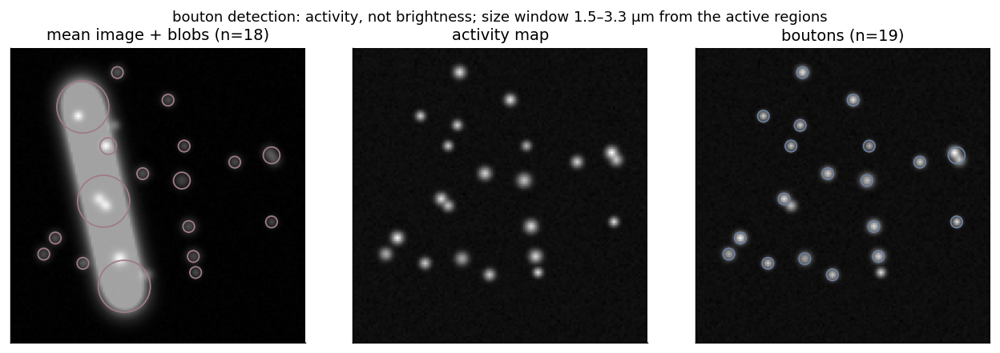

# bouton-detection

Detect axonal boutons by their activity, and let the recording's own active regions set the size
window.

**Ownership tier:** wrapper (blob detection is standard; the activity-based detection and the
data-driven size window are the contribution).



## The idea

A bouton is a spot that fluctuates over time. So detection runs on an activity map (the temporal
variation of the recording), not on the mean image. A bright but static structure, an axon shaft
crossing the plane, is bright in the mean image yet flat in time, so it never appears on the activity
map and is not mistaken for a bouton. The figure shows it: the mean-image detector places large blobs
along the shaft; the activity map has none there.

The size window is not a hardcoded guess. It is read from the recording itself. The active regions,
what a functional segmenter such as Suite2p returns, have a size distribution, and the detection
bounds are taken from that distribution. So "how big is a bouton here" is answered by the data, at
whatever magnification, with a physiological range only as an outer sanity bound.

## Use

```python
from boutons import detect_boutons

boutons, all_blobs, (lo_um, hi_um) = detect_boutons(stack, pixel_size_um=0.3)
# boutons: (row, col, sigma) on the activity map, inside the data-driven size window (lo_um, hi_um)
```

## Run the example

```bash
python -m venv .venv && source .venv/bin/activate    # Python 3.10+
pip install -e . && pip install pytest matplotlib && pip install -e ../../gallery_style
python examples/demo.py         # writes figures/before_after.png
pytest
```

## Compared against

- **Blob detection on the mean image with a fixed size filter.** The mean image is bright wherever
  there is structure, so a static shaft or a dendrite is detected as a bouton, and the size cutoff is
  a number picked in advance. Here detection is on the activity map, so only fluctuating spots count,
  and the size window is read from the active regions of this recording.
- **SVM or CNN bouton classifiers** (for example Bass 2017). Those learn a bouton appearance from
  labelled training data. Here nothing is trained: activity and a data-driven size window do the work.

## License

See `LICENSE`.
