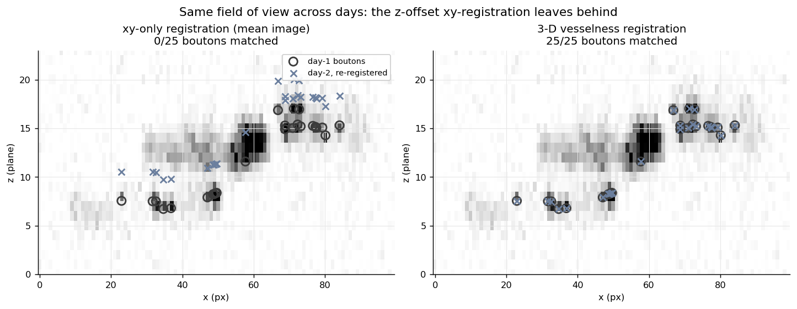

# cross-session-registration

Match the **same field of view across days** in 3-D, by registering the axon arbor's
**vesselness fingerprint** instead of the drifting mean image — so the same physical bouton
is the same coordinate on every day.

**Ownership tier:** hers / thin wrapper (the registration engine is
`skimage.registration.phase_cross_correlation` + a Sato vesselness filter; the contribution is
the 3-D, across-days workflow with the vesselness anchor and the SUBTRACT-convention bouton
matching).



## The idea

Re-imaging the same cortical patch on another day, the field of view does not come back to
exactly the same place. The **x, y** offset a normal motion-correction handles — but the
**focal plane returns to a different depth**, so there is a **z**-offset too, and the
activity-dependent **mean image drifts** day to day (different cells are bright), so
registering on brightness is unreliable.

Two fixes, both in the copied pipeline code:

- **Register in 3-D, on structure, not brightness.** Run the whole z-stack through a 3-D
  **Sato vesselness** filter first: it locks onto the tubular axon arbor — a structural
  fingerprint far more stable across days than the mean image — then phase-correlates the two
  enhanced volumes to recover **(dx, dy, dz) at once**.
- **Then the same boutons match.** With the recovered 3-D shift, each day-1 bouton finds its
  day-2 self within a small radius (SUBTRACT convention: `ref = mov − shift`). A 2-D-only
  registration leaves the z-offset in place, so the z-jittered boutons fall outside the match
  radius and are silently dropped.

The figure makes the cost concrete on synthetic data with a **known** 3-D shift and known
bouton positions: an XZ view (z vertical) of the reference arbor, with day-1 boutons
(circles) and the day-2 boutons brought back by each registration (crosses). Left — xy-only
registration leaves the crosses a few planes off in z, and **0 of 25** boutons match. Right —
3-D vesselness registration snaps them onto the circles, and **25 of 25** match.

## Use

```python
from xsession import register_3d, register_2d, match_boutons, FOVShift

shift = register_3d(ref_stack, mov_stack)          # (z,y,x) stacks → FOVShift(dx,dy,dz_planes,...)
pairs = match_boutons(ref_centroids, mov_centroids, shift)   # [(ref_i, mov_j), ...]

# shifts follow the project SUBTRACT convention: ref_coord = mov_coord − (dx, dy, dz)
```

`register_2d(ref_img, mov_img)` gives the xy-only `(dx, dy, peak)` for comparison.

## Run the example

```bash
python -m venv .venv && source .venv/bin/activate    # Python 3.10+
pip install -e . && pip install pytest matplotlib && pip install -e ../../gallery_style
python examples/demo.py         # writes figures/before_after.png
pytest
```

## Compared against

- **Per-recording / within-session motion correction** (Suite2p, NoRMCorre). Each pass picks
  its own reference and works in 2-D, so it never recovers the across-day **z**-offset — the
  same bouton lands on a different plane on each day.
- **Registering on the mean image.** The activity-dependent mean drifts across days; the axon
  arbor's vesselness does not, so the structural fingerprint is the more stable anchor.

## Limitations

The z resolution is the z-stack's plane spacing (sub-plane z is interpolated, not optical).
Vesselness assumes there IS tubular structure to lock onto — it suits axon/dendrite arbors,
not a soma-only FOV. Registration is rigid (translation in x, y, z); it does not correct
rotation or non-rigid warping across days.

## License

See `LICENSE`.
