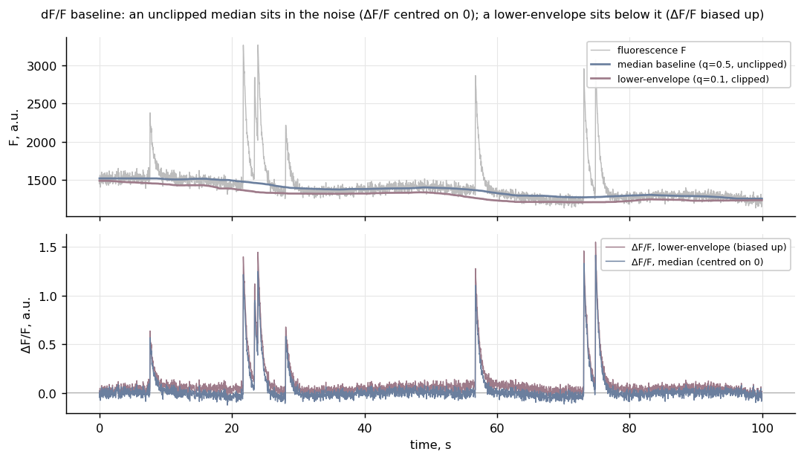

# dff-baseline

A rolling **median** baseline, left unclipped, so ΔF/F sits symmetric around zero.

**Ownership tier:** hers (the zero-centred median-baseline mode is the contribution).



## The idea

ΔF/F = (F − F0) / F0 needs a baseline F0. Take it as a rolling quantile of the
fluorescence, and the quantile you pick decides where zero ends up.

A **median** baseline (q = 0.5), left **unclipped**, sits in the middle of the noise. So
in the quiet stretches ΔF/F is just the noise, symmetric around zero: small dips below the
resting level survive, and a flat trace reads as flat. That honest zero is what lets a
downstream detector treat "below baseline" as real.

A **lower-envelope** baseline (a low quantile, q ≈ 0.1, clipped to a positive floor) sits
in the *lower tail* of the noise, below the resting level. Subtracting something too low
pushes ΔF/F above zero everywhere — a positive pedestal — and makes the noise one-sided.
The figure shows it: the two baselines track the same trace, but the envelope rides below
the median, and its ΔF/F floats above the zero line while the median's straddles it.

## Use

```python
from dffbaseline import median_baseline, lower_envelope_baseline, dff

f0 = median_baseline(F, fps=30.0, win_s=20.0)   # rolling median, unclipped
trace = dff(F, f0)                               # ΔF/F centred on zero
```

## Run the example

```bash
python -m venv .venv && source .venv/bin/activate    # Python 3.10+
pip install -e . && pip install pytest matplotlib && pip install -e ../../gallery_style
python examples/demo.py         # writes figures/before_after.png
pytest
```

## Compared against

- **A lower-envelope / low-percentile baseline** (the classic choice). It sits below the
  resting level, so ΔF/F carries a positive bias and one-sided noise. The median baseline,
  left unclipped, sits in the noise instead, so zero means zero.
- **A polynomial lower-envelope** (peakutils-style). Same story: fit to the trace bottom,
  clip to a positive floor, and ΔF/F rides above zero. The rolling median follows local
  drift without pinning the floor.

## License

See `LICENSE`.
