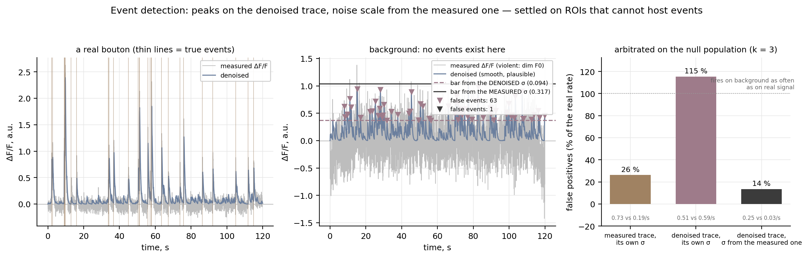

# event-detection-arbitrated

Detect calcium events on the **denoised** trace, with the noise scale taken from the
**measured** one — and settle the choice on ROIs that cannot host events.

**Ownership tier:** hers (the arbitrated rule and the null-population protocol are the
contribution; the deconvolution is third-party).



## The idea

Deconvolution makes events easy to see, and that is exactly the trap.

A dim ROI — one that got drawn on tissue background rather than on a cell — has a violently
noisy ΔF/F, because shot noise is √F0 counts and the trace divides by a tiny F0. Push that
noise through any deconvolution and you get back *smooth, positive, event-shaped* bumps: a
sparse solver keeps the largest excursions and re-convolves them with the indicator kernel.
The denoised trace looks like a well-behaved recording of a quiet cell.

A detector that reads its height bar off that denoised trace has no way to know, because
**denoising shrank the very quantity the bar is measured in**. On the synthetic example that
ships here, the negative-tail σ of the denoised trace is ~3× smaller than the measured
trace's, and more so on background than on real signal — denoising hides most of the noise
exactly where there is most to hide.

So take the two halves from the two traces:

```
threshold = calm_window_baseline(denoised) + clip_k · σ_negative_tail(measured)
```

Peaks come from the denoised trace, where an event has a shape. The scale comes from the
measured trace, which still carries the noise. Both are ratios to the same F0, so σ transfers
with no rescaling. And the reference is the trace's own **calmest-window** baseline rather
than its median, because on an active trace the median sits inside the activity.

## Arbitrating it, instead of arguing about it

Every version of "the bar" looks defensible on a trace you already believe. The way to
separate them is a population that **cannot** contain events — background ROIs from the same
recording — and to report

```
false positives (%) = rate on the null population / rate on the real population × 100
```

A phase-randomised surrogate will not do: it preserves total power, including the energy of
the real transients, so its own σ is inflated and the same variant can score anywhere from a
few per cent to more than half depending only on whose σ it is handed. Real background from
the same recording has no such freedom.

On the synthetic sample (40 boutons, 40 background ROIs, 120 s, k = 3):

| where the bar comes from | real | null | false positives |
|---|---|---|---|
| measured trace, its own σ | 0.73 /s | 0.19 /s | **26 %** |
| denoised trace, its own σ | 0.51 /s | 0.59 /s | **115 %** |
| denoised trace, σ from the measured one | 0.25 /s | 0.03 /s | **14 %** |

The middle row is the trap: it fires on ROIs with no events as often as on real ones. Note
that a detector which fires on nothing would also score 0 % — so the tests check recall on
the known event times as well.

## Use

```python
from arbitrated import detect_events_arbitrated, arbitrate

peaks, thr = detect_events_arbitrated(
    reconstructed, measured_dff, fs=30.0, clip_k=4.0, return_threshold=True)

# and to judge the choice on your own recording, with a mask of ROIs that cannot host events:
for row in arbitrate(dict(dff=DFF, reconstruct=REC, is_bouton=mask, fps=30.0)):
    print(row)
```

`clip_k` is the one knob. Raising it from 3 to 4 rejects noise on low-SNR traces without
clipping real events on good ones, because the bar is k × *each trace's own* σ.

## Run the example

```bash
python -m venv .venv && source .venv/bin/activate    # Python 3.10+
pip install -e . && pip install pytest matplotlib && pip install -e ../../gallery_style
python examples/demo.py         # writes figures/before_after.png
pytest
```

## Compared against

- **median + k·σ on the ΔF/F itself** (the classic). Its bar and its noise come from the same
  trace, so it survives white noise well — and not the positive-going contamination a real
  recording has (neuropil pulled into the ROI, motion carrying brighter tissue across it).
  A σ estimated from the *negative* tail, which is the right robust choice when events live
  on the positive side, then under-estimates what the positive side can do.
- **peaks on the deconvolved/denoised trace with that trace's own noise estimate.** The
  tempting one, and the reason this tile exists.
- **a fixed absolute threshold.** Comparable across nothing: F0 varies by an order of
  magnitude between ROIs in one field of view.

The detector and the two noise primitives are independent copies of the lab-pipeline
functions, synced verbatim into `arbitrated/_synced.py` with provenance and de-identified by
`_sync/`. The synthetic sample, the arbitration protocol, the demo and the tests are the
tile's own.

## License

See `LICENSE`.
