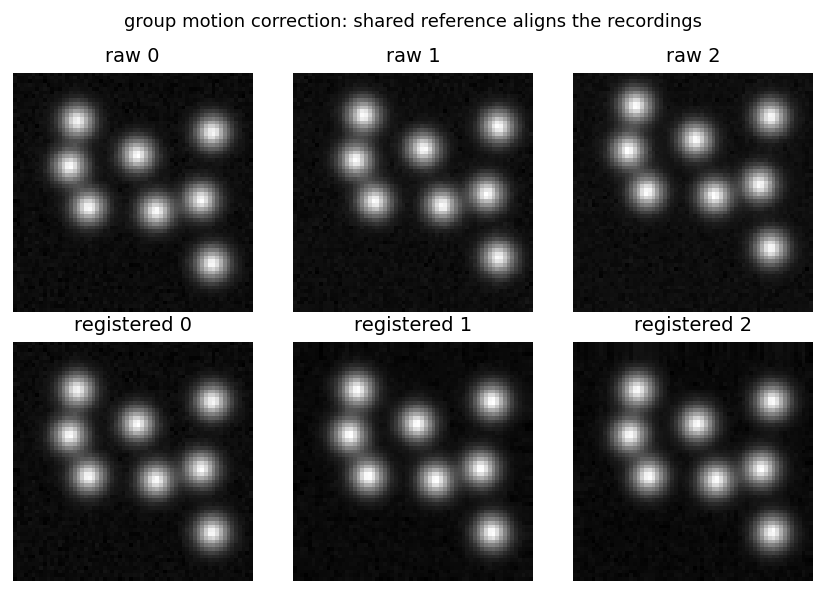

# group-motion-correction

Register several recordings of one field of view to a shared reference, so the same physical
structure lands on the same pixel in every recording.

**Ownership tier:** wrapper (the registration engine is standard; the shared-reference workflow is
the contribution).

## The idea

Motion correction usually runs per recording, and each pass picks its own reference frame. Across
several recordings of the same field of view the references differ, so a cell or bouton sits on
slightly different pixels each time, and an ROI drawn once no longer fits the others.

Here every recording is registered to one shared reference, taken from the first recording's mean
image. One ROI, drawn once, is then the same physical structure in every recording. The registration
itself is standard whole-frame phase correlation; the point is that the reference is shared, so the
outputs are directly comparable.

## Input and output

Input is a list of TIFF recordings of one field of view (in order; the first gives the reference).
Output is one registered TIFF per recording, plus a single HDF5 in a layout that mirrors the
served-report tile:

    /reference                     the shared reference image
    /units/<name>/frames           the registered stack
    /units/<name>/motion_shifts    per-frame (dy, dx), the motion-correction evidence

## Use

```python
from groupmc import correct_tiffs

correct_tiffs(["rec_0.tif", "rec_1.tif", "rec_2.tif"], out_dir="out")
# out/rec_0_registered.tif ... and out/group_corrected.h5
```

## Run the example

```bash
python -m venv .venv && source .venv/bin/activate    # Python 3.10+
pip install -e ".[dev]" && pip install -e ../../gallery_style
python examples/demo.py         # writes registered TIFFs, an HDF5, and figures/before_after.png
pytest
```



The raw recordings (top) sit at different offsets; registered to the shared reference (bottom) the
blobs land on the same pixels.

## Compared against

- **Per-recording motion correction** (Suite2p, NoRMCorre). Each recording is corrected well on its
  own, but to its own reference, so recordings do not line up with each other. Here one reference is
  shared, so they do.
- **Cross-session cell registration** (SCOUT and similar). Those match cells across sessions after
  the fact, from segmented ROIs. Here the frames themselves are brought into a common frame first, so
  an ROI transfers directly.

## License

See `LICENSE`.
