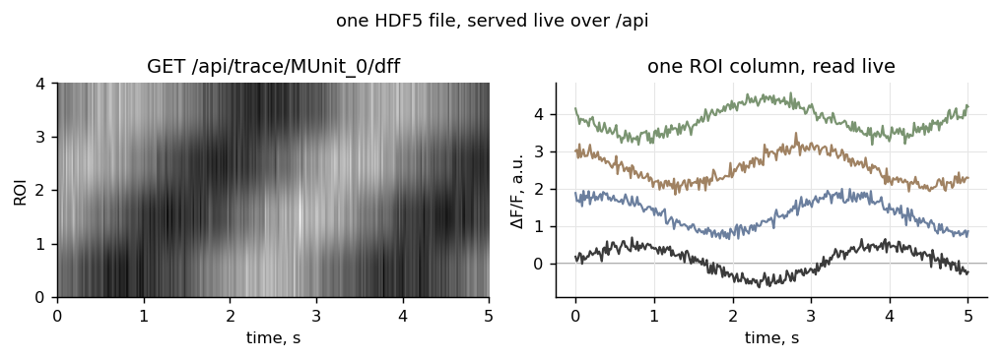

# master-served-report

Serve one self-contained HDF5 experiment file live over a small REST API, so the file is the only
thing you distribute.

**Ownership tier:** hers (an engineering idea, not a lab method or an upstream tool).

## The idea

An imaging experiment produces many artefacts: trace matrices, ROI outlines, per-area structure,
metadata. The usual report bundles these as a folder of sidecar files, or bakes a snapshot into a
static page. Both drift from the data and both are awkward to share.

Here the whole experiment is one HDF5 file with a fixed layout (`served_report/schema.py`), and a
small server reads from it on demand through four `/api/*` endpoints. A browser report fetches only
what a tab needs, when it needs it. Rewrite the file under a running server and the next request
returns the new bytes, because the file handle is cached on `(path, mtime)`. To share the experiment,
copy the one file.



## Endpoints

    GET /api/info                        areas, units, experiment metadata
    GET /api/trace/<unit>/<kind>         a (frames x rois) trace matrix
    GET /api/trace/<unit>/<kind>/<roi>   one ROI column
    GET /api/rois/<area>                 ROI polygons for an area

## Use

```python
from served_report import serve

httpd = serve("experiment_master.h5", port=8765)
httpd.serve_forever()          # GET http://127.0.0.1:8765/api/info
```

## Run the example

```bash
python -m venv .venv && source .venv/bin/activate    # Python 3.10+
pip install -e ".[dev]"
python examples/demo.py         # writes a sample file, serves it, reads three endpoints
pytest                          # the endpoint tests
```

## Compared against

- **A folder of sidecar exports.** Every tab reads its own CSV/PNG/JSON; the set drifts from the data
  and travels as a directory. Here one file is the source, read live.
- **A static HTML dump.** A snapshot with the numbers baked in; re-running the analysis means
  re-exporting. Here the report reads the current file, so a re-derive is visible on refresh.
- **A database-backed viewer.** A server plus a schema plus a migration. Here the HDF5 file is the
  store, and the four readers are the whole backend.

## License

See `LICENSE`.
