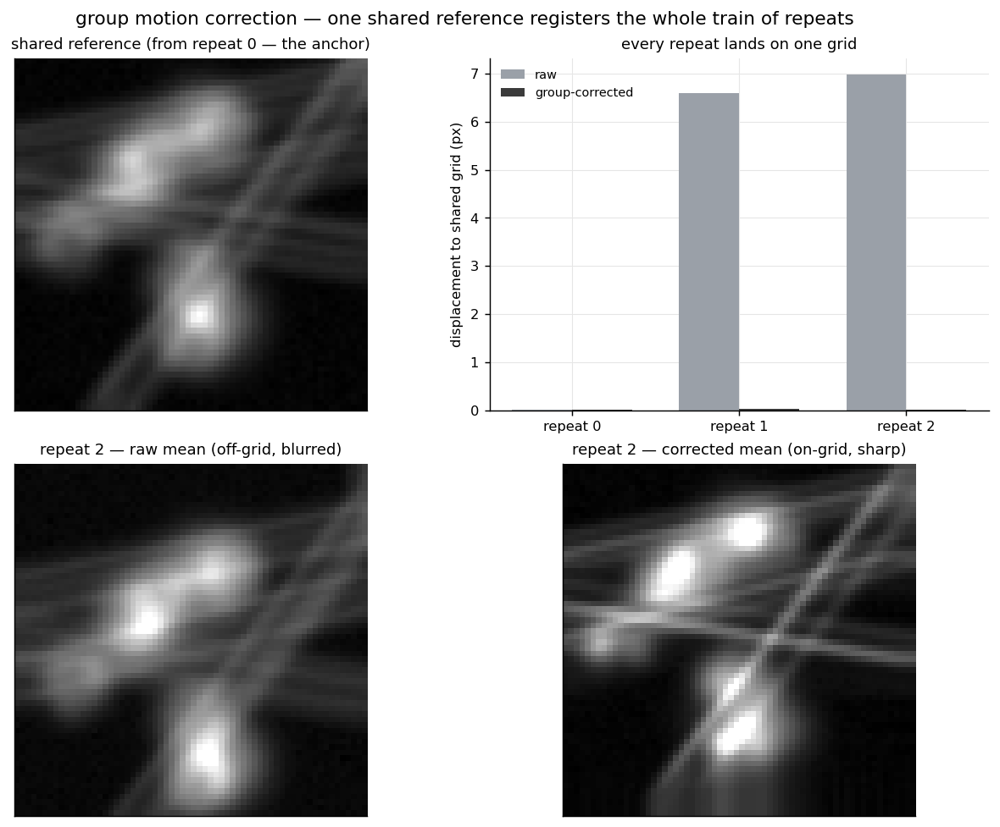

# mesc-motion-correct

**Group** (concat) motion correction for Femtonics **.mesc** files: register a whole *train* of
repeat recordings of one field of view to **one shared reference**, and write corrected `.mesc`
files back out. Rigid, phase-correlation; the maximum shift and the intensity offset are both read
**from the file**, not assumed.

**Ownership tier:** lab method (the *group / concatenated* shared-reference scheme is the lab's
approach) + wrapper on an open technique (rigid phase-correlation registration, as in Suite2p). This
is an independent, dependency-light reimplementation for the gallery; **explicit lab consent before it
goes public**, and Suite2p is cited as the production engine.



## Why *group*

Repeat recordings of one FOV each drift a little, and each sits a little differently to begin with.
Correct each repeat to *its own* reference and you remove the within-repeat drift but leave every
repeat on **its own grid** — so one ROI no longer fits them all. The group method fixes this:

1. build **one shared reference** from the **first** unit of the train — the early-tissue anchor
   (later repeats have already deformed, so the reference must come from the start);
2. **hand that reference** to the correction of *every* unit in the concatenated train;
3. every frame of every repeat is registered to the **same** pixel grid.

In the figure, the raw repeats sit 6–7 px off the shared grid (their baseline offsets); after group
correction every repeat lands on it (~0 px). That shared grid is what lets one consensus ROI set
apply across all the repeats of a FOV.

The production pipeline runs this as **concat-MC over Suite2p** (`force_refImg` = the first unit's
reference, rigid, `nonrigid=False`). Suite2p emits `data.bin` / TIFF, never a `.mesc`; the extra
contribution here is the faithful **`.mesc` in → `.mesc` out** round-trip.

## Parameters read from the .mesc (not hard-coded)

- **Intensity offset** — `Channel_k_Conversion_ConversionLinearOffset` (the PMT pedestal, −786 green
  / −1170 red). Read per channel and subtracted so the background sits at zero and the reference /
  phase correlation lock onto tissue, not the pedestal. A missing attr falls back to the PMT default
  **and says so loudly**.
- **Pixel size** — `XAxisConversionConversionLinearScale` (µm/px). The max shift is a **physical**
  distance (µm); it is turned into a pixel clamp with this, so the same setting behaves the same on
  any FOV. Announced loudly (which pixel size, what pixel clamp).

The green channel (`Channel_0`) drives the registration; the **same** shift is applied to every
channel (they are one scan). Output frames stay in native counts and every conversion attribute is
preserved, so the corrected file is a valid, self-describing `.mesc` (the applied shifts are recorded
on each unit).

## Use

```python
from mescmc import group_motion_correct_mesc, build_group_reference, correct_train

# a train of repeats of one FOV → one _MC.mesc each, all on the shared grid
group_motion_correct_mesc(["rep0.mesc", "rep1.mesc", "rep2.mesc"], "out/", max_shift_um=20)

# or hold the shared reference yourself and apply it
train = [("rep0.mesc", "MSession_0/MUnit_0"), ("rep1.mesc", "MSession_0/MUnit_0")]
ref = build_group_reference(train)          # from the first unit — the anchor
results = correct_train(train, ref)         # every unit registered to `ref`
```

CLI:

```bash
python -m mescmc rep0.mesc rep1.mesc rep2.mesc -o out/     # train → out/<stem>_MC.mesc
python -m mescmc rep0.mesc --list                          # units, pixel size, offset, frame rate
python -m mescmc rep0.mesc rep1.mesc -o out/ --max-shift-um 15
```

## Run the example

```bash
python -m venv .venv && source .venv/bin/activate    # Python 3.10+
pip install -e . && pip install pytest matplotlib && pip install -e ../../gallery_style
python examples/demo.py        # synthetic train → the shared-grid figure
pytest
```

## Notes

- The example writes a **synthetic** train (one static scene, per-repeat baseline offset + within-
  repeat drift + jitter, on a realistic −786 / −1170 pedestal) so the correction can be scored
  against known shifts — repeats land within a fraction of a pixel of the shared grid.
- Registration is rigid (whole-frame translation), amplitude-blind (a flat pedestal cancels in the
  phase spectrum), with a high-pass pre-filter so it locks onto structure. Non-rigid is out of scope
  here — the production Suite2p path has it if needed.
- Frames are loaded per unit into memory; fine for the tile, and for real recordings on a machine
  with room. The pipeline's concat-MC streams/chunks for the full-size case.

## License

See `LICENSE`.
