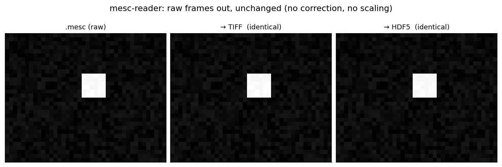

# mesc-reader

Read a Femtonics **.mesc** file and convert it — **raw** — to TIFF stacks or a plain HDF5. No
motion correction, no PMT-offset, no scaling: the frames come out exactly as stored, with the
acquisition metadata carried alongside.

**Ownership tier:** hers / wrapper (a clean, minimal open reader of a documented on-disk layout;
the production pipeline's MESc handling is entangled with motion correction — a standalone
raw converter is the contribution).



## The idea

A .mesc is just an **HDF5** file with a fixed layout:

```
/MSession_i/MUnit_j                      one recording unit
    attrs: ZDim (frames), XDim, YDim,    dimensions
           ZAxisConversion…Scale (ms/frame → frame rate),
           XAxisConversion…Scale (µm/px),
           VecChannelsSize, Channel_k_Conversion_ConversionLinearOffset, …
    Channel_0, Channel_1, …              (frames, height, width) arrays, one per channel
```

`mesc-reader` walks that layout, reads any channel's frames **exactly as stored** (the integer
counts, unchanged), and writes them out unmodified — one TIFF stack per unit/channel, or a plain
HDF5 mirror — with the acquisition attributes travelling with the frames so nothing is lost. The
per-channel linear conversion is **reported** in the metadata but never applied: *as-is* means
the stored values.

## Use

```python
from mescreader import list_units, read_frames, mesc_to_tiff, mesc_to_hdf5

for u in list_units("recording.mesc"):
    print(u["path"], u["frames"], u["frame_rate_hz"], u["channels"])

frames = read_frames("recording.mesc", "MSession_0/MUnit_0", "Channel_0")   # (T,H,W), raw
mesc_to_tiff("recording.mesc", "out/")            # one raw TIFF per unit/channel
mesc_to_hdf5("recording.mesc", "out.h5")          # a plain HDF5 mirror
```

Or the CLI:

```bash
python -m mescreader recording.mesc --list
python -m mescreader recording.mesc --tiff out/
python -m mescreader recording.mesc --hdf5 out.h5
```

## Run the example

```bash
python -m venv .venv && source .venv/bin/activate    # Python 3.10+
pip install -e . && pip install pytest matplotlib && pip install -e ../../gallery_style
python examples/demo.py         # writes a synthetic .mesc, converts it, confirms bit-identical
pytest
```

## Notes

- The example uses a **synthetic** .mesc (a tiny file written in the same layout, with a known
  frame pattern) so the round-trip can be checked against ground truth without any real data.
- "Raw" is deliberate. If you want real photon-ish counts, apply the reported per-channel
  conversion (`Channel_k_Conversion_ConversionLinearOffset` and the linear scale) yourself — this
  tool never does it for you.
- The layout above covers single- and multi-channel, single- and multi-unit files. Vendor files
  carry many more attributes; they are all preserved by `read_metadata` and the HDF5 mirror.

## License

See `LICENSE`.
