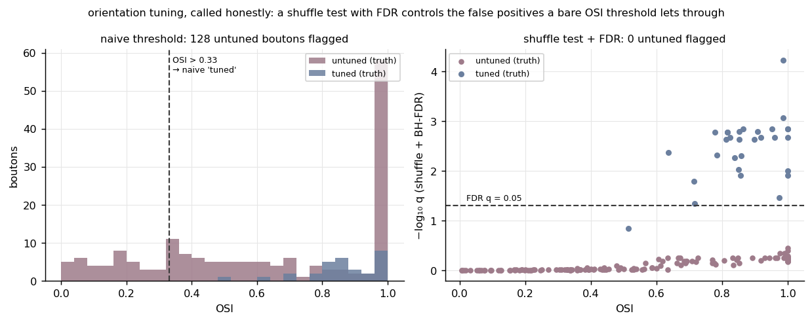

# osi-stats

Orientation selectivity called with a **shuffle test and FDR across the population**, not a
bare OSI threshold.

**Ownership tier:** wrapper (OSI, the shuffle test, and Benjamini-Hochberg are standard;
doing the population call rigorously is the contribution).



## The idea

The Orientation Selectivity Index, OSI = (R_pref − R_orth) / (R_pref + R_orth), is a point
estimate. With a modest trial count and real noise it is **positively biased**: an untuned
neuron still scores OSI > 0 by chance, because "preferred" and "orthogonal" are picked
*after* seeing the noise. So a fixed threshold (OSI > 0.33) flags a crowd of genuinely
untuned boutons as tuned — the left panel shows the untuned OSI distribution spilling well
past the line.

The honest call keeps OSI as a descriptive number but *decides* tuning with a test. A
**shuffle test** rebuilds OSI's own bias as a null: permute the per-trial responses across
orientation slots, recompute OSI many times, and z-score the observed OSI against that null
distribution. The observed OSI is significant only if it beats the bias — and because a
z-scored p-value is continuous (not floored at 1/n_shuffle), it can go small enough to
survive the population correction. Then, since every bouton is tested,
**Benjamini-Hochberg FDR** turns the p-values into q-values that control the
false-discovery rate. The right panel plots OSI against −log₁₀ q: the genuinely tuned
boutons rise above the q = 0.05 line, and the biased-but-untuned ones fall below it. Same
data, far fewer false positives.

Three details that matter, all reproduced from the pipeline:

- **OSI folds directions into orientation space** [0°, 180°) and **rectifies negative
  responses** (on zero-centred ΔF/F the orthogonal response can go negative and blow up the
  index).
- **The shuffle null is z-scored, not counted.** Counting shuffles that beat the observed
  OSI floors the p-value at 1/n_shuffle; after multiplying by a whole population that can
  never reach q < 0.05. Z-scoring against the shuffle mean and SD gives a continuous tail.
- **A Rayleigh test is provided too** (`rayleigh_test`) with the sample size set to the
  number of sampled directions, not Kish's effective n on the response weights (Kish inverts
  the test's power for tuning). But a Rayleigh test on rectified baseline-subtracted
  responses has a non-uniform null, so the population call uses the shuffle test.

## Use

```python
from osistats import classify_population

# trials_by_bouton: (n_boutons, n_orientations, n_trials)
r = classify_population(trials_by_bouton, orientations, osi_thr=0.33, alpha=0.05)
tuned = r["honest"]        # bool per bouton: shuffle p, BH-FDR-corrected, q < 0.05
r["osi"], r["pval"], r["qval"]
```

`bootstrap_osi_ci(trials, orientations)` gives a percentile CI on a single bouton's OSI.

## Run the example

```bash
python -m venv .venv && source .venv/bin/activate    # Python 3.10+
pip install -e . && pip install pytest matplotlib && pip install -e ../../gallery_style
python examples/demo.py         # writes figures/before_after.png
pytest
```

## Compared against

- **A bare OSI threshold** (OSI > 0.3, the common shortcut). No significance, no
  multiple-comparison control, so the positive bias leaks untuned cells straight into the
  "tuned" count. Here OSI stays descriptive and a shuffle test makes the call.
- **Per-neuron significance with no population correction.** Testing hundreds of boutons at
  α = 0.05 expects ~5% false positives by construction; Benjamini-Hochberg controls the
  false-discovery rate across the family.

## License

See `LICENSE`.
