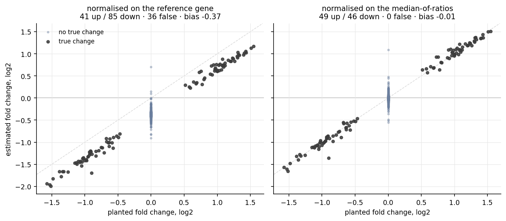

# paired-pseudobulk

When subjects differ from each other more than the conditions differ, compare **inside the
subject** — and then be careful how you normalise, because the obvious normaliser can invent
the result.



## The problem

Single-nucleus experiments usually offer two contrasts: *between subjects* (disease vs control)
and, when the design allows it, *within subject* (two sorted populations from the same donor).
The between-subject one is the tempting one and often the confounded one — cohorts collected
years apart, different chemistry, different tissue quality.

Given a paired design, two decisions then settle the answer:

1. **The unit.** Nuclei from one subject are not independent samples. Sum them into one
   pseudobulk profile per subject and let the *subject* be the unit — otherwise thousands of
   nuclei manufacture significance that eight subjects do not support.
2. **The baseline.** A per-gene log ratio needs a reference. Reaching for a single, highly
   expressed marker feels principled ("normalise to the pan-class marker"), and it is the
   trap this tile is built around.

## What it shows

The figure runs both normalisations on the same synthetic experiment, with a truth planted:
50 genes up, 50 down, subject variation deliberately larger than the effect, and one
"reference-looking" gene that is itself shifted.

| normalised on | called | up / down | false discoveries | bias on null genes |
|---|---|---|---|---|
| the reference gene | 126 | 41 / 85 | **36** | **−0.40** |
| median-of-ratios | 95 | **49 / 46** | **0** | −0.00 |

Same data, same test — only the normalisation differs. The shifted reference tilts every other
gene downward by ~0.4 log2, producing a **one-sided** list (85 down vs 41 up) with 36 genes that
have no true change at all. Median-of-ratios size factors recover the planted 50/50 with no false
discoveries.

**The rule:** centre on the robust middle of the distribution, and check any candidate reference
gene against it. If your chosen normaliser moves several times more than the median gene, it is
not a baseline — it is one of your results.

`top_gene_share()` is the companion diagnostic: it reports how much of a library its top genes
hold, which is the *other* way per-10k normalisation can mislead. Run it; on these data it comes
back mild, which is itself worth knowing.

## A second trap, at small n

The signed-rank test cannot return a p-value below `2 / 2**n` — 0.0078 with eight subjects. After
multiple-testing correction across a few thousand genes, nothing clears q<0.05 until roughly two
hundred genes sit exactly at that floor, **and a biased analysis reaches that count more easily
than an unbiased one**: the rank test can end up rewarding the artefact it was meant to expose.
So `paired_test` defaults to a paired t-test on the log-ratios and keeps `test="wilcoxon"` as an
option for larger n. Read the direction count (`n_up`) alongside either.

## Use

```python
from pairedpb import paired_log2fc, paired_test, top_gene_share

print(top_gene_share(control), top_gene_share(treated))     # diagnostic first
lfc = paired_log2fc(treated, control)                       # (subjects × genes), rows paired
res = paired_test(lfc)                                      # median_lfc, n_up, p, q, significant
```

```bash
python examples/demo.py     # scores both normalisations and rebuilds the figure
pytest tests/ -q
```

## Where it came from

A public human dataset (GEO **GSE129308**) sorts nuclei from the same donor into two fractions,
which makes the within-subject contrast available. Normalising it on a pan-neuronal marker gave
**588 genes down and 15 up** — an asymmetry that looked like biology and was arithmetic: the
marker shifted +0.32 log2 per donor while the median gene shifted +0.09. Centred robustly, the
same comparison gives a balanced list. The demo here reproduces that failure on synthetic data,
where the truth is known.

## Benchmarked against

DESeq2 / edgeR (median-of-ratios and TMM are the established robust normalisations — this is a
small, dependency-light implementation of the same idea, not a replacement), and the common
practice of normalising to a housekeeping or pan-class marker, which is what it argues against.
