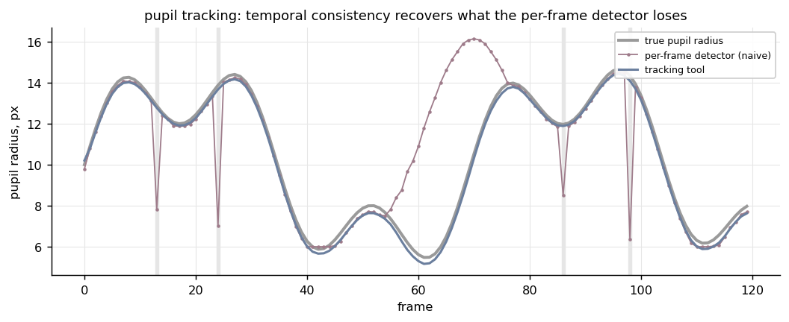

# pupil-tracking

Turn a per-frame pupil detector into one clean pupil-size trace, by running it across the
video with temporal consistency.

**Ownership tier:** mixed, with consent. The per-frame detector is Sonja Nevelchuk's
algorithm (used with permission); the tracking tool shown here is the contribution.



## The idea

A per-frame detector guesses the pupil independently in every frame: threshold the dark
pixels, take the largest dark blob, read off its centre and radius. On its own it drifts.
A bright corneal glint or a dark eyelid corner makes it pick the wrong blob; a blink leaves
only a spurious dark patch. The figure shows both failures: a broad hump (frames ~55–80)
where the swelling eyelid-corner blob becomes the largest dark region and the naive detector
climbs to it, and sharp downward spikes at the blink frames, where the closed eyelid gives a
wrong radius instead of an honest gap.

The tracking tool keeps only what is temporally consistent. Among each frame's candidates
it takes the one nearest the previous pupil centre with a similar radius (so the far-away
corner blob is rejected even when it is larger), interpolates short gaps (blinks), and
lightly smooths the result. What comes out follows the true pupil radius through both the
distractor and the blinks.

## Use

```python
from pupiltrack import track_pupil

result = track_pupil(frames)          # frames: (n_frames, H, W), an eye-ROI stack
radius = result["radius"]             # clean per-frame pupil radius (px)
status = result["status"]             # "detected" / "interpolated" / "lost"
```

## Run the example

```bash
python -m venv .venv && source .venv/bin/activate    # Python 3.10+
pip install -e . && pip install pytest matplotlib && pip install -e ../../gallery_style
python examples/demo.py         # writes figures/before_after.png
pytest
```

## Compared against

- **The per-frame detector alone.** No memory between frames, so it follows whichever dark
  blob is largest — the eyelid corner when it swells — and latches onto a spurious patch on a
  blink. The tracking tool uses the previous frame as a prior to pick the right candidate,
  reject those, and bridge the blink frames.
- **Trained pose/keypoint models** (for example DeepLabCut) for pupil tracking. Those learn
  the pupil from labelled training data. Here nothing is trained: a per-frame detector plus
  temporal-consistency bookkeeping do the work.

## Attribution

The **per-frame pupil detector** (`detect.py`) is **Sonja Nevelchuk's** algorithm,
re-implemented in NumPy/SciPy for a self-contained demo and included here **with her
permission**. The **tracking tool** (`track.py`) — candidate selection by a temporal prior,
gap interpolation, and smoothing — is the contribution this tile shows.

## License

See `LICENSE`. The attribution above applies regardless of license.
