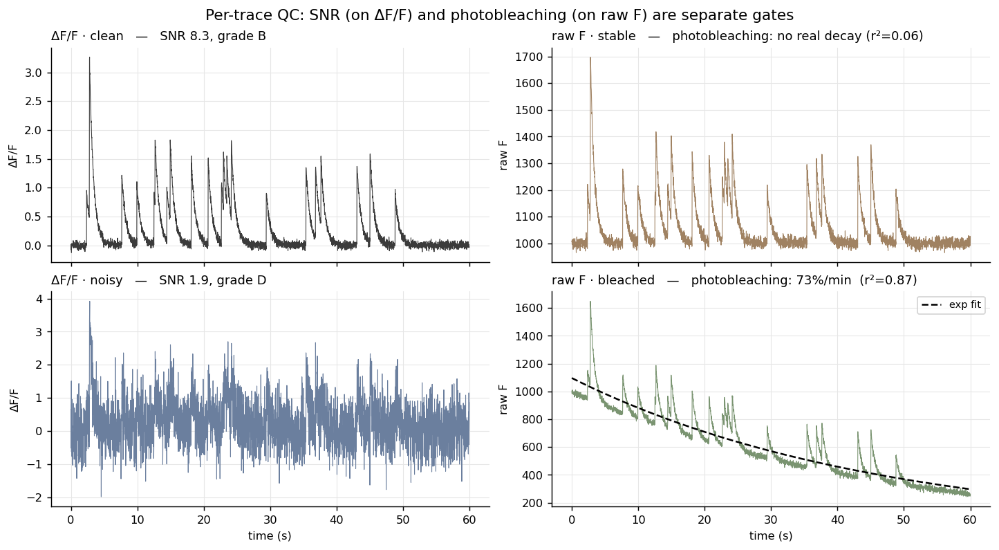

# trace-qc

Two per-trace quality gates for calcium imaging — **is the signal real** (SNR) and **is the
recording un-bleached** (photobleaching) — each computed on the representation it belongs to.

**Ownership tier:** wrapper (SNR and an exponential-decay fit are standard; the MAD-based
noise floor and running each gate on the right representation are the point).



## The idea

SNR and photobleaching answer different questions about **different versions of the trace**,
and running either on the wrong version is misleading:

- **SNR — on the ΔF/F trace.** After the rolling baseline is removed, SNR reflects event
  quality. Noise is the trace's median absolute deviation × 1.4826 (the Gaussian-equivalent
  σ), not the std of a "quiet" window: MAD is robust to sparse calcium events and works
  whether the ΔF/F is zero-centred (median baseline) or positive-shifted (lower-envelope),
  where a fixed low-percentile estimate is biased. SNR then maps to an **A–F grade**
  (`QualityGrade.from_score`).
- **Photobleaching — on the raw fluorescence,** *before* ΔF/F, where the slow decay still
  lives. Fit F(t) = A·exp(−t/τ) + B and report the % lost per minute, with an **r² gate**: a
  flat trace will let `curve_fit` return something, so a low r² means there is no real decay.

They are **not** independent on the same raw trace — a decay strong enough to fit with a high
r² dominates the raw signal and wrecks its SNR, which is exactly why SNR is measured on the
ΔF/F that has had the decay removed. So the gates run in sequence on the pipeline's two
representations: check the raw trace for bleaching, then grade the ΔF/F's SNR.

The figure shows both on synthetic traces with a **known** problem: ΔF/F *clean* (good SNR) vs
*noisy* (low SNR), and raw *stable* (no decay, r² gated out) vs *bleached* (a strong decay the
fit catches, drawn dashed).

## Use

```python
from traceqc import snr, photobleaching

q = snr(trace, fs=60.0)                 # snr_peak, snr_mean, noise_floor, quality_score, grade
b = photobleaching(trace, fs=60.0)      # tau, decay_rate (%/min), r_squared, fit_success
# trust the decay only when b["r_squared"] is high
```

## Run the example

```bash
python -m venv .venv && source .venv/bin/activate    # Python 3.10+
pip install -e . && pip install pytest matplotlib && pip install -e ../../gallery_style
python examples/demo.py         # writes figures/before_after.png
pytest
```

## Scope

- Both checks apply to **any** calcium trace, soma or bouton.
- **Neuropil-contamination** correction is deliberately **out of scope**: it is a soma-imaging
  concern and is not applied to boutons (a bouton is too small for the surrounding-neuropil
  model). It is available in the pipeline for soma work.
- **Motion / spatial trustworthiness** — residual xy shift and z-drift (a bouton leaving the
  focal plane and reading as falsely silent) — is a different question and lives in the
  `trace-trustworthiness` tile. A per-trace jump detector alone conflates a calcium onset (a
  genuine fast rise) with a motion jump, so real motion needs cross-ROI information.

## License

See `LICENSE`.
