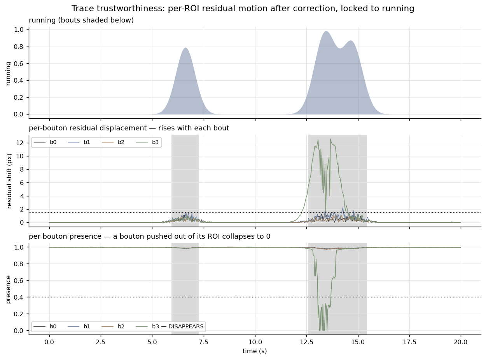

# trace-trustworthiness

Motion correction is done — but is a bouton's trace still trustworthy? When the animal runs or
moves, the tissue shifts in the field of view (x, y **and** z), non-uniformly, so each bouton
keeps its **own residual motion**, and a big enough bout can push a bouton clean out of its ROI.
This asks the question **per ROI**, on that bouton's own pixels.

**Ownership tier:** hers / wrapper (the per-frame registration is the pipeline's `register_fov_xy`;
the per-ROI residual-motion + disappearance read-out, and locking it to running, are the contribution).



## The idea

Global motion correction (Suite2p) removes the *average* frame shift. But the brain is not a
rigid block: during running or spontaneous movement, different parts of the field move by
different amounts, so correction leaves each bouton a **residual** shift — and it does nothing in
**z**, where the focal plane moving defocuses the bouton. A large bout can move a bouton out of
its ROI, or out of the plane, so that for those frames the ROI is measuring **background, not the
bouton** — no matter how good the global correction was.

So the check is per ROI. Each frame's local patch is registered to a still template of the same
patch with the pipeline's `register_fov_xy`, which returns both signals at once:

- **residual displacement** √(dx² + dy²) — how far this bouton's pixels shifted after correction;
- **presence** = the post-alignment correlation peak (0–1) — how well the patch still matches the
  bouton's footprint. It falls when the bouton leaves the patch laterally, and when it defocuses
  in z; near 0 means the bouton has **disappeared** and the trace is background.

A frame is untrustworthy for a bouton if its residual shift is large or its presence is low.
Given a running trace, both line up with movement — the corruption is **locomotion-locked**.

On synthetic data (an already-corrected movie), three boutons keep a small residual shift that
rises with every bout but stay present (`run_corr ≈ 0.95`), while one bouton is shoved ~12 px out
of its ROI during the strongest bout and its presence collapses to 0 — correctly flagged as
having disappeared, during running, not at rest.

## Use

```python
from tracetrust import assess

# stack: (T,H,W) ALREADY motion-corrected movie; rois: {name:(cy,cx,half_box)}; run: (T,) optional
report = assess(stack, rois, fps, run=running_trace)
report["MyBouton"]["max_shift_px"]       # residual in-plane shift of this bouton's pixels
report["MyBouton"]["disappeared"]        # did it ever leave the FOV / defocus out?
report["MyBouton"]["motion_flag"]        # per-frame: untrustworthy?
report["MyBouton"]["run_corr"]           # is the residual motion locomotion-locked?
```

## Run the example

```bash
python -m venv .venv && source .venv/bin/activate    # Python 3.10+
pip install -e . && pip install pytest matplotlib && pip install -e ../../gallery_style
python examples/demo.py         # writes figures/before_after.png
pytest
```

## Limitations

The residual displacement is measured against a still template (the per-pixel median over time),
so it assumes the bouton is present for most of the recording. Presence uses the registration's
correlation peak, which drops for both lateral loss and z-defocus but does not by itself say
*which* — a true z-stack (see `cross-session-registration`) resolves z directly. This flags WHERE
the tissue moved and where a bouton is untrustworthy; it does not try to separate a real
movement-driven neural response from the motion artifact.

## License

See `LICENSE`.
